# stellar

[](https://stellar.laundromatai.app)
[](https://stelllar--seanraynon.asia-east1.hosted.app)
[](https://laundromatai.app/)
[](https://app.laundromatai.app/app?demo=1)
[](https://github.com/seansabado/stellar)
[](https://github.com/seansabado/stellar/actions/workflows/post-deploy-smoke.yml)
[](https://stellar.laundromatai.app/.well-known/stellar.toml)
[](https://github.com/seansabado/stellar/commits/main)
[](https://docs.google.com/presentation/d/1n6tGEixR1ePmFnOjmU1daJfj2xHD21QKashvyntPLKI/edit?usp=sharing)
[](LICENSE)

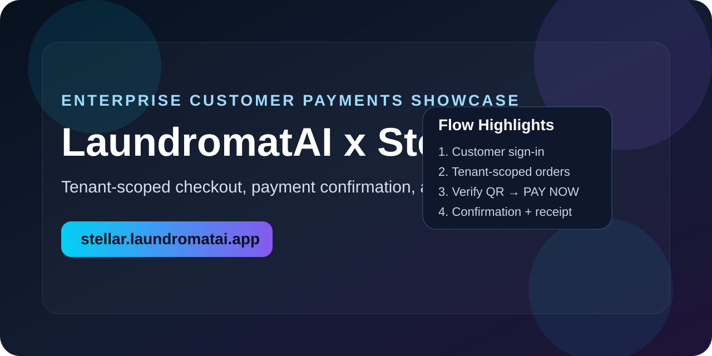

## Demo Video

[](https://youtu.be/j7AWyGVniZg)

> Full end-to-end walkthrough: SaaS order → customer checkout → Stellar payment confirmation → receipt history.

**Stellar-powered payments for laundry MSMEs.** Real orders, on-chain confirmation, and receipt persistence — embedded in production-ready merchant workflows. [Try the live demo →](https://stellar.laundromatai.app)

LaundromatAI × StellarPay connects tenant-scoped order visibility, identity-backed customer access, Stellar ledger verification, and receipt history into one fast, auditable checkout flow — built for frontline operations in the Philippines and Southeast Asia.

## Executive Summary

Service businesses need a payment flow that is easy for customers, trustworthy for operators, and auditable for support teams. StellarPay addresses that requirement with a mobile-first customer experience that:

- resolves tenant-scoped customer orders
- guides the customer into a two-step payment flow
- checks Stellar payment status from pending to confirmed
- persists receipts for replayable proof and support visibility
- stays aligned with LaundromatAI branding and demo-tenant operating rules

This repository is the public engineering artifact for that experience.

## Live Access


- Official Website: [laundromatai.app](https://laundromatai.app/)
- SaaS Demo: [app.laundromatai.app](https://app.laundromatai.app/app?demo=1)
- Repository: [github.com/seansabado/stellar](https://github.com/seansabado/stellar)
- Custom domain: [stellar.laundromatai.app](https://stellar.laundromatai.app)
- App Hosting backend: [stelllar--seanraynon.asia-east1.hosted.app](https://stelllar--seanraynon.asia-east1.hosted.app)
- Demo tenant scope: `demo-tenant-ph`
- Local development: [localhost:3001](http://localhost:3001)

## Stellar Explorer Accounts

- Testnet account: [stellar.expert/testnet](https://stellar.expert/explorer/testnet/account/GBK4EPWBVRS5KLW6AR2QTPFD5ZUJIVCP3KTEY2CIF6QOCAYY4SDZO6WC)
- Public account: [stellar.expert/public](https://stellar.expert/explorer/public/account/GBDZXAJCTGPMASCYPPE6V5NYRBWFFRYSTL4QV72IJ6JYQEI62QIPEQMG)

## Quick Entry Points

- Quick demo script: [docs/demo-script.md](docs/demo-script.md)
- Architecture overview: [docs/architecture.md](docs/architecture.md)
- Hiring manager one-pager: [docs/hiring-manager.md](docs/hiring-manager.md)
- Case study: [docs/case-study.md](docs/case-study.md)


## Visual Preview

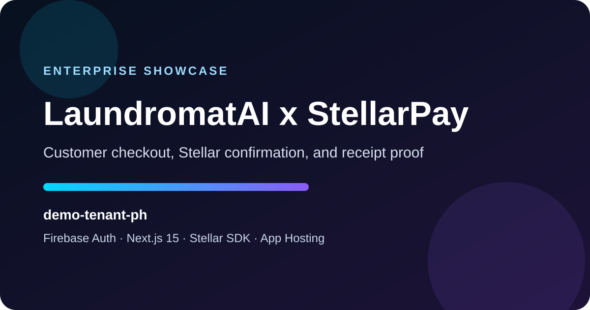

## Screenshots

Below are sample UI screens from the StellarPay (LaundromatAI × StellarPay) production app:

<table>
	<tr>
		<th>Login Screen</th>
		<th>Dashboard</th>
		<th>Orders</th>
	</tr>
	<tr>
		<td>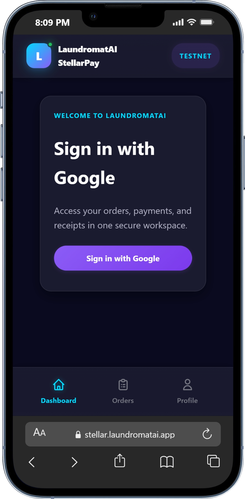</td>
		<td>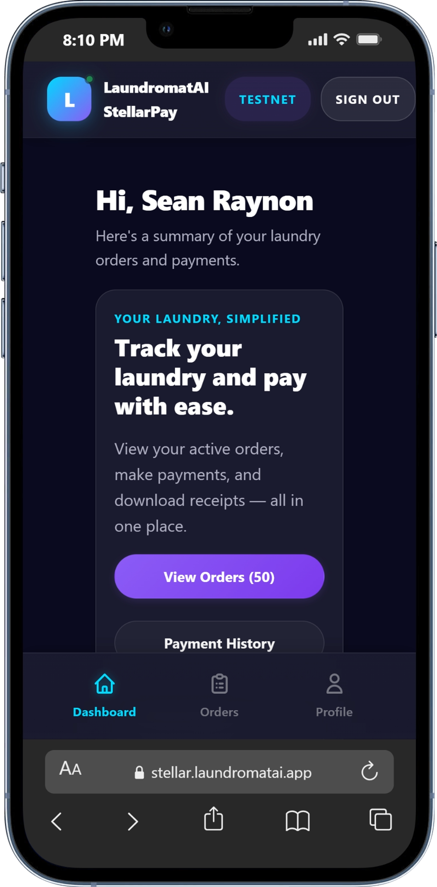</td>
		<td>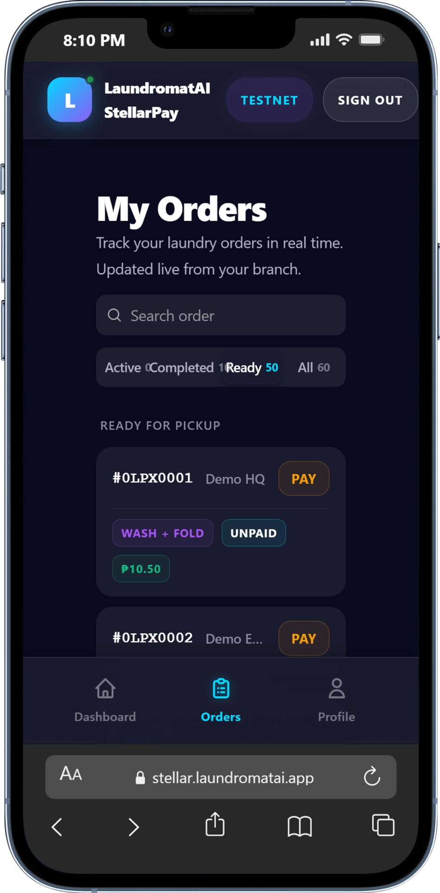</td>
	</tr>
	<tr>
		<th>Profile</th>
		<th>Checkout</th>
		<th>QR Capture</th>
	</tr>
	<tr>
		<td>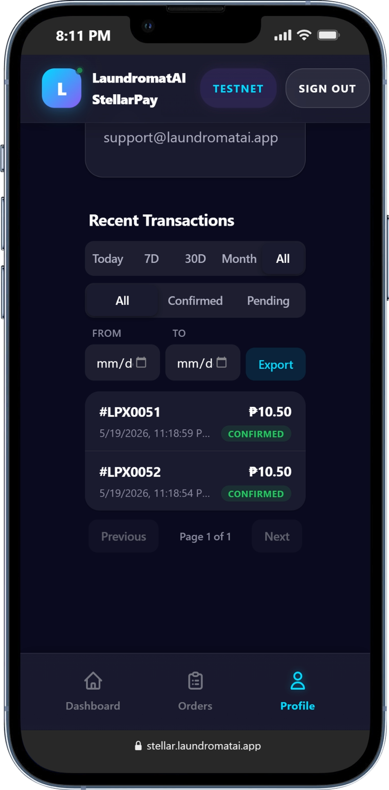</td>
		<td>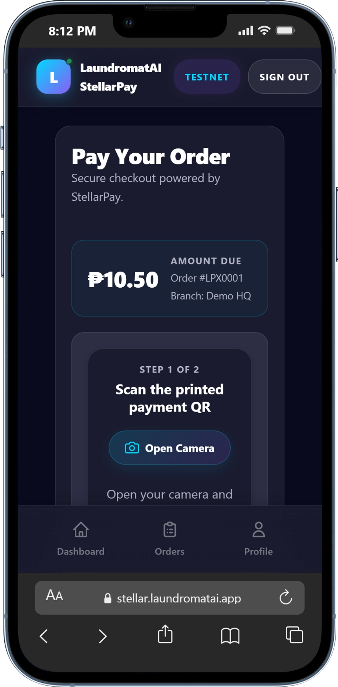</td>
		<td>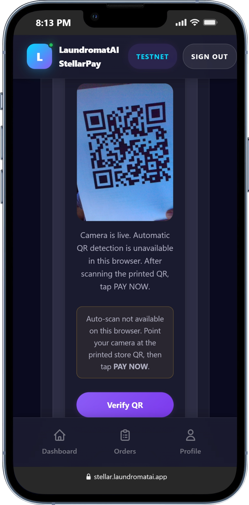</td>
	</tr>
	<tr>
		<th>Stellar Ledger</th>
		<th>Ledger History</th>
		<th>QR Verified</th>
	</tr>
	<tr>
		<td>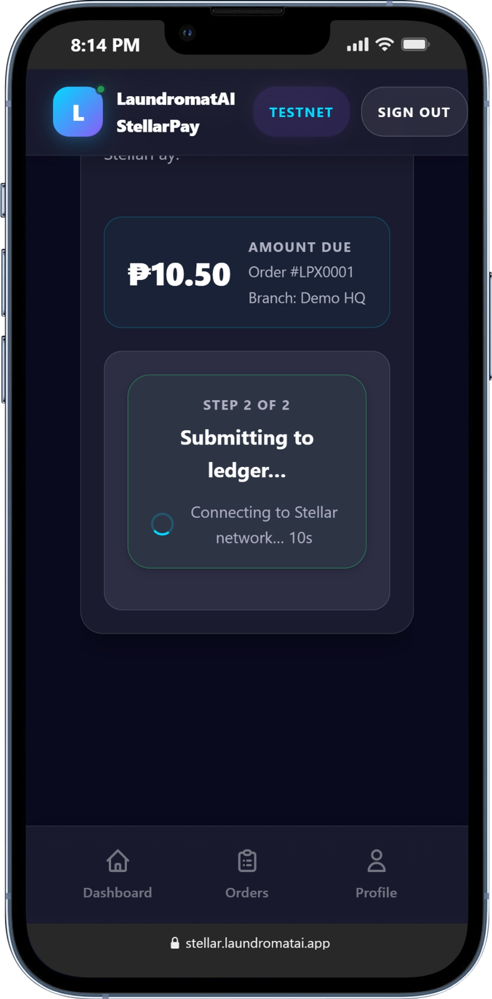</td>
		<td>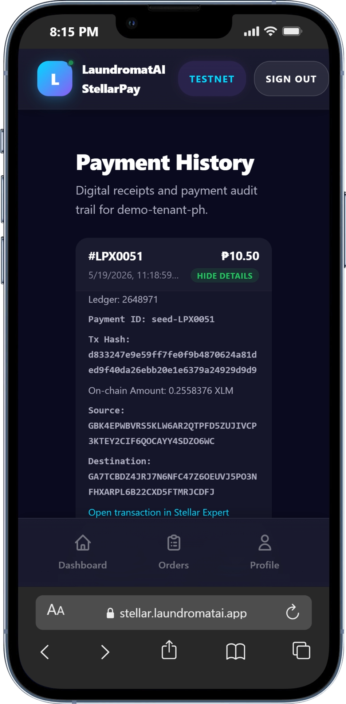</td>
		<td>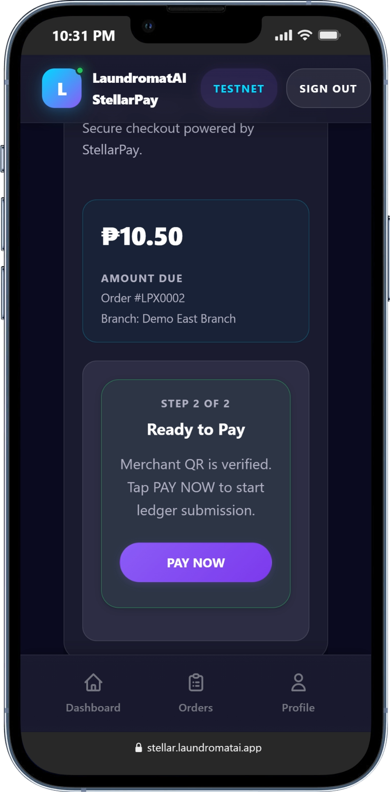</td>
	</tr>
	<tr>
		<th>Ledger Confirmation</th>
		<th></th>
		<th></th>
	</tr>
	<tr>
		<td>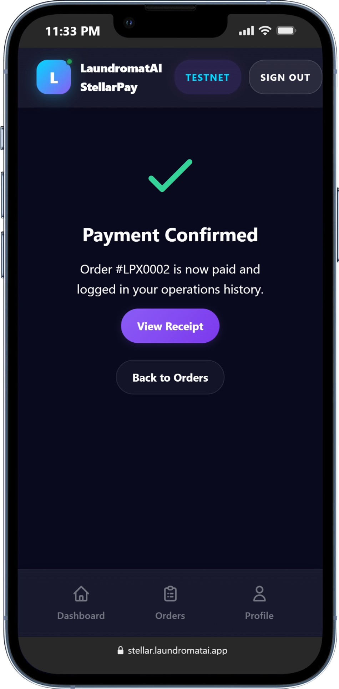</td>
		<td></td>
		<td></td>
	</tr>
</table>

## Why Stellar?

For MSME operators in the Philippines and SEA, traditional payment rails create three hard problems:

| Problem | Stellar's Answer |
|---|---|
| **Settlement speed** | Transactions confirmed in under 5 seconds, 24/7/365 — no bank windows, no batch delays |
| **Cost** | Fractions of a US penny per transaction — viable for ₱50–₱500 laundry orders |
| **Auditability** | Every payment is on-chain and immutable — eliminates screenshot disputes between staff and customers |
| **Cross-border readiness** | Built-in anchor ecosystem enables PHP ↔ USDC and remittance flows without rewiring the payment layer |
| **No chargebacks** | Finality is real — confirmed means confirmed, no reversal risk for merchants |

For an MSME commerce platform, Stellar is the only rail that is simultaneously fast enough for counter operations, cheap enough for micro-transactions, and auditable enough for dispute resolution.

## Business Outcomes

- Faster customer checkout: mobile-first payment flow reduces friction at the counter.
- Better trust: status transitions, ledger references, and receipt history make payment outcomes clear.
- Safer operations: tenant-scoped order resolution and auth-gated routes reduce ambiguity in demo and pilot use.
- Better demo readiness: the app is designed to show an end-to-end customer payment journey, not just isolated screens.

## What This Repository Demonstrates

| Area | What it demonstrates |
| --- | --- |
| Customer checkout | Guided order-to-payment experience with scan, pay, confirmation, and receipt history |
| Tenant isolation | Customer data and order flow scoped to the demo tenant `demo-tenant-ph` |
| Identity-backed access | Firebase customer sign-in gate before sensitive payment actions |
| Payment proof | Confirmation polling, transaction references, timeline state, and receipt persistence |
| Operational resilience | Demo/live fallback order loading, runtime hardening, service worker safeguards |
| Deployment discipline | Firebase App Hosting rollout model with smoke-test automation and production verification |

## Architecture Flow

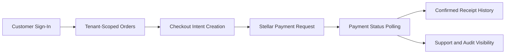

## Core Capabilities

### Customer Experience

- Mobile-first app shell with top and bottom navigation
- Google sign-in flow for customer session continuity
- Orders list with operational filters and action states
- Dedicated pay route per order
- Payment history and profile views

### Payment Workflow

- Stellar payment request creation
- Two-step checkout flow with merchant QR verification and explicit `PAY NOW`
- Confirmation polling with pending and confirmed proof states
- Receipt persistence for post-payment history
- Transaction reference visibility for support and audit trails

### Reliability and Demo Readiness

- SaaS/demo order fallback path for continuity
- Local runtime protection against stale Next.js asset issues
- Service worker safeguards for local development stability
- Post-deploy smoke test automation for public routes and assets

## Read Path By Audience

- Recruiter or judge, 2-3 minutes:
	- Start with this README
	- Then read [docs/demo-script.md](docs/demo-script.md)
	- Then read [docs/case-study.md](docs/case-study.md)
	- Then read [docs/showcase.md](docs/showcase.md)
	- Then use [docs/judge-pitch-script.md](docs/judge-pitch-script.md)

- Engineering manager, 5-8 minutes:
	- Start with [docs/hiring-manager.md](docs/hiring-manager.md)
	- Then read [docs/architecture.md](docs/architecture.md)
	- Then review [docs/project-index-map.md](docs/project-index-map.md)
	- Then read [docs/all-features.md](docs/all-features.md)
	- Then read [docs/resume.md](docs/resume.md)

- Architect, CTO, or technical reviewer, 10-15 minutes:
	- Start with [docs/architecture.md](docs/architecture.md)
	- Then read [docs/interview-walkthrough.md](docs/interview-walkthrough.md)
	- Then review [docs/stellar-hackathon-execution-plan.md](docs/stellar-hackathon-execution-plan.md)
	- Then read [docs/customer-oauth-flow.md](docs/customer-oauth-flow.md)
	- Then review [docs/nextjs-migration.md](docs/nextjs-migration.md)

## Product Walkthrough

### 60-Second Demo Path

1. Open the customer app.
2. Sign in and show tenant-scoped orders.
3. Open an unpaid order and show the PHP amount.
4. Verify the merchant QR and trigger `PAY NOW`.
5. Show the payment transition from pending to confirmed.
6. Open History and show the saved receipt.

### Judge-Facing Proof Points

- Tenant-scoped customer flow tied to `demo-tenant-ph`
- Identity-backed customer session before payment actions
- PHP pricing and customer-facing payment messaging
- Payment confirmation timeline and receipt persistence
- Hosted deployment on Firebase App Hosting

## Technical Snapshot

- Framework: Next.js 15
- UI: React 19 + TypeScript
- Identity: Firebase Authentication
- Payment integration: Stellar SDK
- APIs: Next.js route handlers
- Hosting: Firebase App Hosting (`stelllar`, `asia-east1`)
- Runtime styling: shared CSS with mobile-first shell behavior

## Repository Structure

### Primary App Routes

- [src/app/page.tsx](src/app/page.tsx) - customer dashboard
- [src/app/orders/page.tsx](src/app/orders/page.tsx) - orders list and action lane
- [src/app/pay/[orderId]/page.tsx](src/app/pay/%5BorderId%5D/page.tsx) - checkout and payment proof flow
- [src/app/history/page.tsx](src/app/history/page.tsx) - payment receipts and history
- [src/app/profile/page.tsx](src/app/profile/page.tsx) - customer profile and recent transaction context

### Supporting Modules

- [src/components/QRScanner.tsx](src/components/QRScanner.tsx) - merchant QR verification flow
- [src/components/AddToHomeScreenBanner.tsx](src/components/AddToHomeScreenBanner.tsx) - install prompt UX
- [src/lib/customerAuth.tsx](src/lib/customerAuth.tsx) - customer auth provider
- [src/lib/clientDemoOrders.ts](src/lib/clientDemoOrders.ts) - tenant-scoped order resolution and fallback
- [src/lib/receiptStore.ts](src/lib/receiptStore.ts) - receipt persistence
- [server/utils/stellar.ts](server/utils/stellar.ts) - Stellar request and confirmation helpers

## Documentation Map

- [docs/showcase.md](docs/showcase.md) - one-page project showcase
- [docs/demo-script.md](docs/demo-script.md) - 60-second and 3-minute demo walkthrough
- [docs/case-study.md](docs/case-study.md) - engineering case study narrative
- [docs/hiring-manager.md](docs/hiring-manager.md) - hiring manager one-pager
- [docs/architecture.md](docs/architecture.md) - system architecture overview
- [docs/interview-walkthrough.md](docs/interview-walkthrough.md) - interview-ready walkthrough guide
- [docs/project-index-map.md](docs/project-index-map.md) - route and module ownership map
- [docs/all-features.md](docs/all-features.md) - active feature inventory
- [docs/resume.md](docs/resume.md) - state cursor, verification notes, and session ledger
- [docs/stellar-hackathon-execution-plan.md](docs/stellar-hackathon-execution-plan.md) - execution plan and win condition
- [docs/judge-pitch-script.md](docs/judge-pitch-script.md) - judge-facing walkthrough script
- [docs/hackathon-questionnaires.md](docs/hackathon-questionnaires.md) - copy/paste submission answers for hackathon forms
- [docs/customer-oauth-flow.md](docs/customer-oauth-flow.md) - auth flow notes
- [docs/win-sprint-readiness.md](docs/win-sprint-readiness.md) - delivery readiness notes

## Local Development

### Prerequisites

- Node.js 20+
- npm 10+

### Run Locally

```bash
npm install
npm run dev:once
```

Open:

- http://localhost:3001

### Production Build Check

```bash
npm run build
```

### Production Smoke Check

```bash
npm run smoke:production
```

## Deployment Model

The application is deployed through Firebase App Hosting rollout workflows.

- Build command: `npm run build`
- Run command: `npm run start`
- Hosting backend: `stelllar`
- Region: `asia-east1`

Operationally, the repository now includes a post-deploy smoke workflow for public route and asset verification after deployment.

## Security and Governance Direction

- Customer routes are auth-gated before sensitive actions
- Payment flow remains tenant-scoped to demo customer context
- Receipt history provides transaction proof visibility after confirmation
- Deployment verification and smoke checks are treated as part of delivery quality

This repository is intended to be a professional public showcase. It should help reviewers understand engineering judgment, payment-flow reliability concerns, and customer experience design without requiring a full internal system walkthrough.

## Current Status

- App Hosting deployment is active
- Core customer flows are operational
- Runtime and asset stability hardening has been applied
- Payment UX and mobile tap reliability have been actively refined
- Local build verification is passing

## Known Limits

- Local-to-production parity is not yet perfect because auth and data behavior differ by environment
- Demo flow is intentionally scoped to `demo-tenant-ph`
- Some flows still prioritize demo reliability over full production generalization

## Author

**Sean Raynon**  
Founder & CTO — LaundromatAI

| | |
|---|---|
| 📧 Email | [hello@laundromatai.app](mailto:hello@laundromatai.app) |
| 📞 Phone | [+1 (877) 415-5442](tel:+18774155442) |
| 🌐 Website | [laundromatai.app](https://laundromatai.app/) |
| 💼 LinkedIn | [linkedin.com/in/seanraynon](https://www.linkedin.com/in/seanraynon/) |
| 👤 Personal | [seanraynon.com](https://seanraynon.com/) |
| 📰 Media Kit | [laundromatai.app/media](https://laundromatai.app/media) |
| 📍 Address | 254 Chapman Rd, Ste 208, Newark, Delaware 19702, USA |


