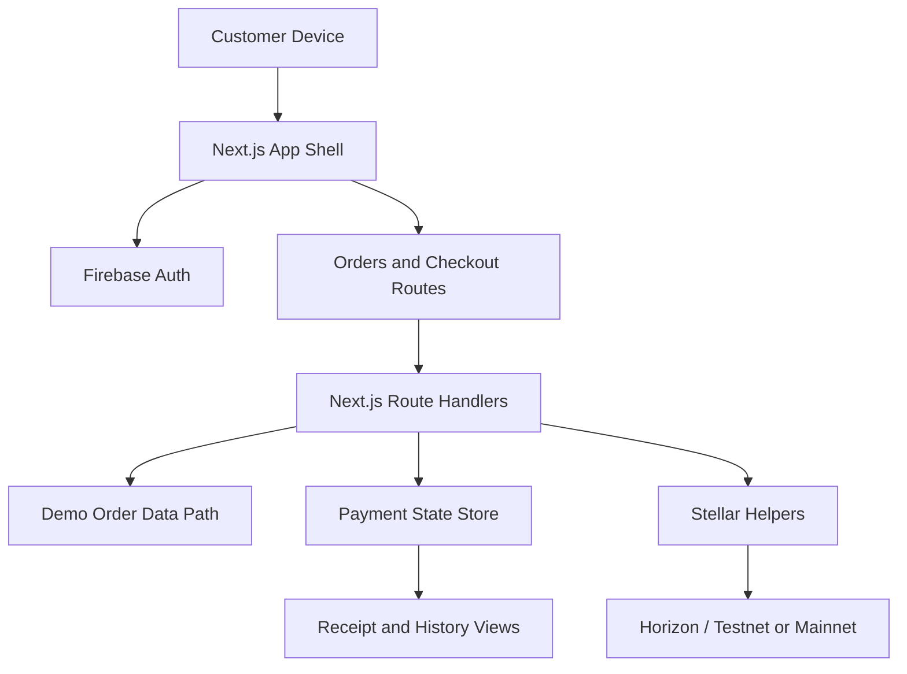

# Stellar Architecture Overview

## Purpose

This document explains the high-level architecture of the StellarPay customer payments showcase.

The system is intentionally narrow in scope: it focuses on a customer-facing payment experience that can resolve tenant-scoped orders, authenticate the customer, create a payment intent, confirm payment status, and persist receipt history.

## System Goal

Show a credible end-to-end customer journey for LaundromatAI x StellarPay:

1. customer signs in
2. customer sees the correct order context
3. customer initiates payment
4. system checks payment confirmation state
5. customer and support surfaces retain payment proof

## High-Level Flow

## Main Architectural Layers

### 1. Customer App Shell

Primary files:

- `src/app/layout.tsx`
- `src/app/AppFrame.tsx`
- `src/index.css`

Responsibilities:

- establish the top-level application shell
- render navigation and mobile-first layout behavior
- keep the customer flow consistent across dashboard, orders, pay, history, and profile

### 2. Identity Layer

Primary files:

- `src/lib/customerAuth.tsx`
- `docs/customer-oauth-flow.md`

Responsibilities:

- enforce signed-in customer context before protected actions
- bind demo customer flow to `demo-tenant-ph`
- keep the app aligned to the LaundromatAI Firebase Auth model instead of inventing a separate identity stack

### 3. Order Resolution Layer

Primary files:

- `src/app/orders/page.tsx`
- `src/lib/clientDemoOrders.ts`
- `src/lib/customerData.ts`
- `src/lib/useAppBase.ts`

Responsibilities:

- resolve customer-visible orders for the target tenant
- provide demo/live fallback behavior for continuity
- route the same customer flow under `/` and `/stelllar` contexts when needed

### 4. Checkout and Payment UX Layer

Primary files:

- `src/app/pay/[orderId]/page.tsx`
- `src/components/QRScanner.tsx`
- `src/components/MobileSuccessScreen.tsx`

Responsibilities:

- render the payment route for a selected order
- enforce the verify-then-pay interaction pattern
- present pending, retry, timeout, and confirmed states
- keep mobile tap behavior reliable enough for PWA-like usage

### 5. API and Payment Orchestration Layer

Primary files:

- `src/app/api/create-stellar-payment/route.ts`
- `src/app/api/check-stellar-payment/route.ts`
- `server/utils/stellar.ts`
- `server/utils/paymentState.ts`

Responsibilities:

- create payment intent and QR payload
- store and update payment snapshots
- poll and validate payment confirmation state
- write enough proof data for receipt and support visibility

### 6. Receipt and History Layer

Primary files:

- `src/app/history/page.tsx`
- `src/lib/receiptStore.ts`
- `src/lib/stellarService.ts`

Responsibilities:

- render receipts after payment completion
- preserve payment references for customer review
- provide support-friendly post-payment visibility

## Key Design Decisions

### Tenant Scope First

This showcase treats tenant scope as a first-class operating rule. The customer flow is bound to `demo-tenant-ph` so that order resolution, payment state, and presentation are all anchored to one demo context.

### Identity Before Sensitive Actions

Payment flow is not treated as a public anonymous surface. The customer must enter with a valid auth-backed session before trusted order and payment state is shown.

### Explicit Payment Proof

The architecture does not end at payment initiation. It includes confirmation checks, pending/confirmed states, and receipt persistence because support and operational trust depend on what the user sees after tapping pay.

### Demo Reliability Over Broad Generalization

The repository is optimized to prove a specific end-to-end flow clearly. Some logic is intentionally scoped for demo reliability rather than building a fully generalized platform abstraction.

## Deployment Model

Hosting target:

- Firebase App Hosting backend `stelllar`
- region `asia-east1`

Operational characteristics:

- production build via `npm run build`
- post-deploy smoke validation for key routes and assets
- route and asset hardening to reduce public demo regressions

## Current Architectural Risks

1. Local-to-production parity is still imperfect because auth and live data behavior vary by environment.
2. Demo confirmation timing can still be influenced by network/testnet conditions.
3. Customer device behavior, especially on iPhone PWA, remains a practical checkout risk and requires focused validation.

## Why This Architecture Matters

The value of this repo is not just that it connects a UI to Stellar helpers. The stronger signal is that it treats customer payments as a workflow crossing identity, tenant scope, proof generation, deployment discipline, and mobile reliability.

That is the level at which enterprise reviewers usually evaluate trust in a payment-facing product.